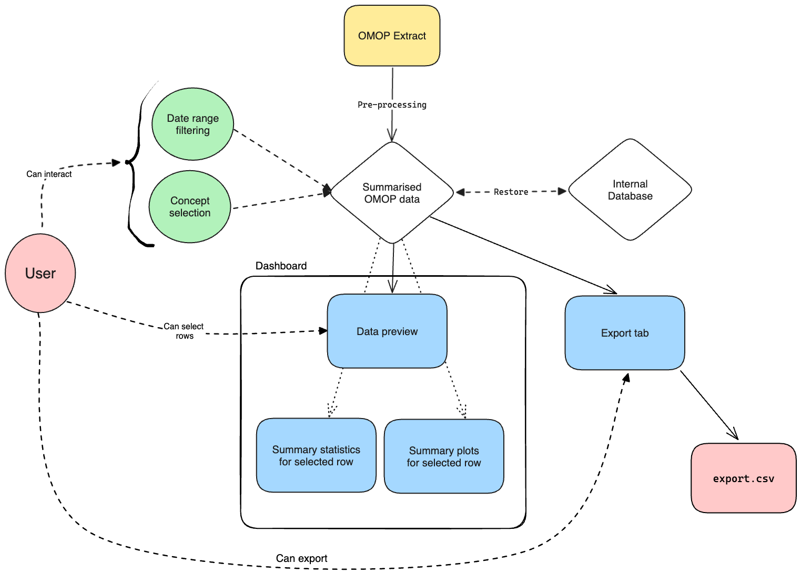

# calypso

<!-- badges: start -->
[](https://lifecycle.r-lib.org/articles/stages.html#experimental)
[](https://github.com/UCLH-Foundry/omop-data-catalogue/actions/workflows/R-CMD-check.yaml)
<!-- badges: end -->

The goal of calypso is to provide a summary of OMOP data and display it in a public data catalogue

## Installation

You can install the development version of calypso from within R like so:

```r
# install.packages("pak")
pak::pak("UCLH-Foundry/calypso")
```

## Development

### Set up

Make sure you have a [recent version of R](https://cloud.r-project.org/) (>= 4.0.0) installed.
Though not required, [RStudio](https://www.rstudio.com/products/rstudio/download/) is recommended as an IDE,
as it has good support for R package development and Shiny.

1. Clone this repository

    - Either with `git clone git@github.com:UCLH-Foundry/omop-data-catalogue.git`
    - Or by creating [a new project in RStudio from version control](https://docs.posit.co/ide/user/ide/guide/tools/version-control.html#creating-a-new-project-based-on-a-remote-git-or-subversion-repository)

2. Install [`{renv}`](https://rstudio.github.io/renv/index.html) and restore the project library by running the following from an R console in the project directory:

    ```r
    install.packages("renv")
    renv::restore()
    ```
3. Create the [duckdb](https://github.com/duckdb/duckdb) test database and run the analyses by running from an R console in the project directory (test dataset properties can be updated in the [`.Rprofile`](https://github.com/UCLH-Foundry/omop-data-catalogue/blob/main/.Rprofile) file):

    ```r
    source(here::here("dev/test_db/setup_test_db.R"))
    source(here::here("dev/omop_analyses/analyse_omop_cdm.R"))
    ```

4. To preview the app locally, run the following from an R console within the project directory:

    ```r
    golem::run_dev()
    ```

The `dev/02_dev.R` script contains a few helper functions to get you started.
 
### Design

The Shiny app is developed using the [`{golem}`](https://engineering-shiny.org/golem.html) framework.
Among other things, this means that we make heavy use of [Shiny modules](https://mastering-shiny.org/scaling-modules.html).
In brief, a Shiny module is a self-contained, encapsulated piece of Shiny UI and server logic.
In practice, this will often be a particular component of the dashboard.
Note that it is possible to nest modules within other modules, leading to a hierarchical structure.

The filenames in `R/` follow the [`{golem}` conventions](https://engineering-shiny.org/golem.html#understanding-golem-app-structure):

* The `app_*.R` files define the UI and server logic for the app itself.
* The `mod_*.R` files define the UI and server logic for the modules.
* Any business logic functions, which are independent from the app's application logic, are defined in the `fct_*.R` files.

An overview of the app's design is given in the diagram below (note that this is subject to change):



### Coding style

We'll mainly follow the [tidyverse style guide](https://style.tidyverse.org/).
The [`{styler}`](https://styler.r-lib.org/index.html) package can be used to automatically format R code to this style,
by regularly running

```r
styler::style_pkg()
```

within the project directory.
It's also recommended to install [`{lintr}`](https://github.com/r-lib/lintr) and regularly run

```r
lintr::lint_package()
```

(or have it [run automatically in your IDE](https://lintr.r-lib.org/articles/editors.html)).
